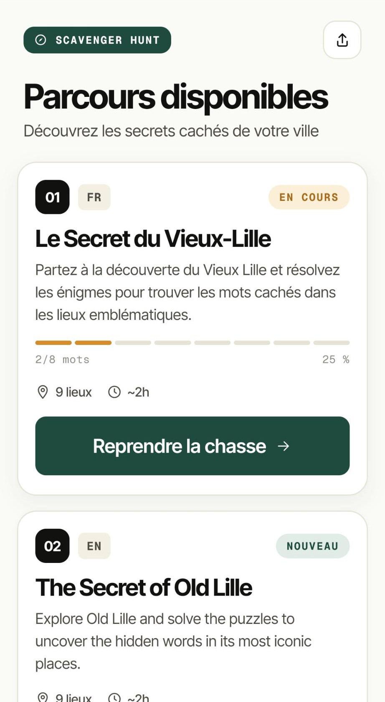
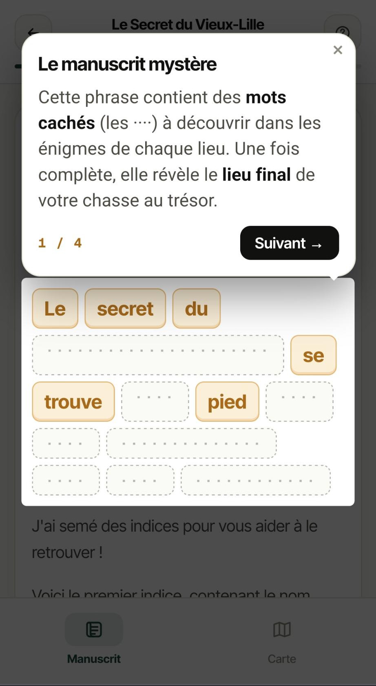
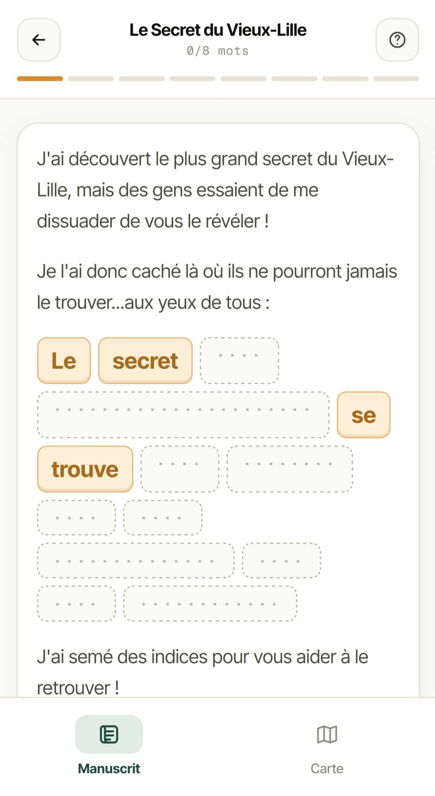
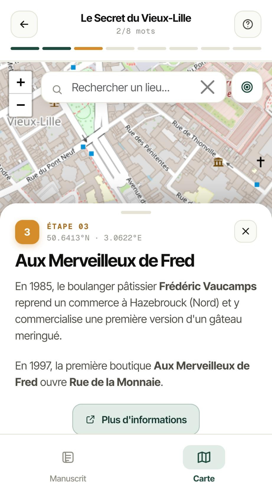
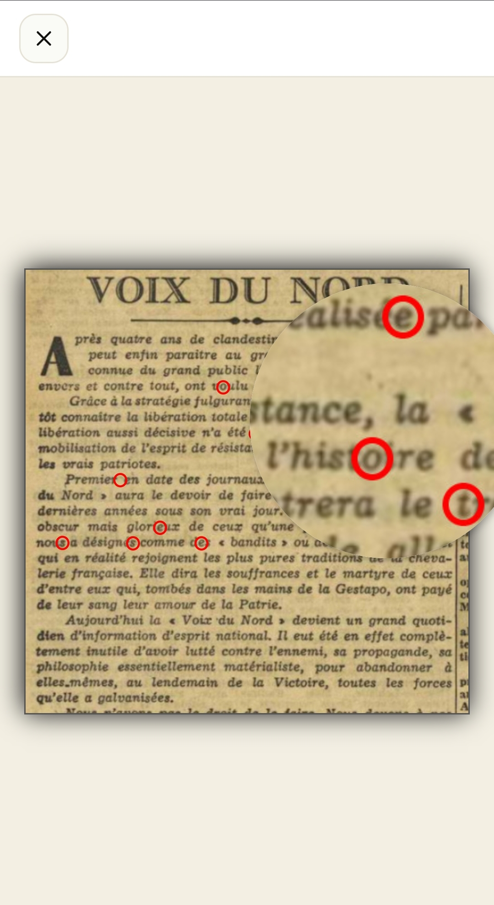
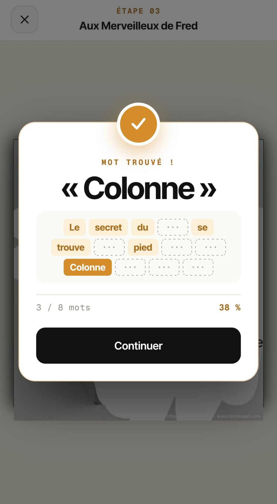
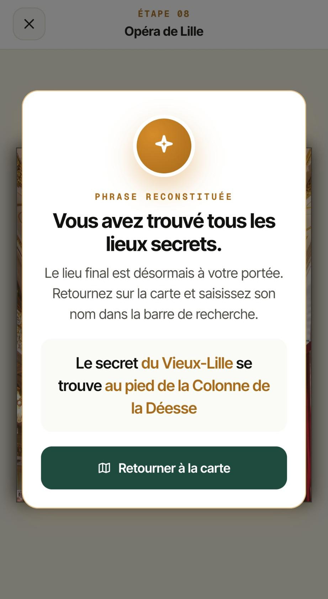

# Scavenger Hunt

> A mobile-first web application for creating location-based scavenger hunts with interactive clues and challenges.

## 📖 Overview

This application lets you create and play scavenger hunts that guide players through various locations. Players solve clues, complete challenges, and collect keywords to progress through the game.

**Built with:** [Next.js 16](https://nextjs.org/) (App Router + Turbopack), [TypeScript](https://www.typescriptlang.org/), [React Leaflet](https://react-leaflet.js.org/), and [OpenStreetMap](https://www.openstreetmap.org/).

**Highlights:**
- 📱 Mobile-first UI (Direction C: sober palette, sans-serif typography, inline SVG icons)
- 🗺️ Free, key-less mapping via Leaflet + OpenStreetMap tiles
- 🌍 Built-in i18n (French / English) with per-hunt language selection
- 🧭 Onboarding tour powered by [driver.js](https://driverjs.com/) on first launch
- 🧩 8 interactive item types (3D, scratch card, magnifier, page-flip, ...)
- 💾 Local progress persistence via `localStorage`
- 📦 Static export — deploys anywhere (GitHub Pages, Netlify, S3/CloudFront, ...)

**Deployment:** Optimized for static hosting platforms like [GitHub Pages](https://pages.github.com/).

---

## 📸 Preview

| Hunts list | Onboarding tour | Manuscript (phrase to reconstruct) |
|:---:|:---:|:---:|
|  |  |  |

| Map with place details | Magnifier puzzle | Keyword found |
|:---:|:---:|:---:|
|  |  |  |

| Phrase reconstructed |
|:---:|
|  |

---

## 🚀 Getting Started

### Prerequisites

- Node.js 18+ and npm
- A mobile device or mobile browser emulator (the app is mobile-only)

### Installation

1. **Clone the repository**
   ```bash
   git clone <your-repo-url>
   cd scavenger-hunt
   ```

2. **Install dependencies**
   ```bash
   npm install
   ```

3. **Run the development server**
   ```bash
   npm run dev
   ```

4. **Open the application**
   
   Navigate to [http://localhost:3000](http://localhost:3000) on your mobile device or browser.

<details>
<summary>📱 Testing on a real mobile device</summary>

To test on your phone while running the dev server on your computer:

1. Make sure your phone and computer are on the same network
2. Find your computer's local IP address:
   ```bash
   # On Linux/Mac
   ip addr show | grep inet
   # or
   ifconfig | grep inet
   ```
3. On your phone, navigate to `http://YOUR_IP_ADDRESS:3000`
</details>

---

## 🎮 Creating Your Hunt

### Quick Start

Edit the `config.json` file to create your scavenger hunt:

```json
{
  "hunts": [
    {
      "slug": "my-first-hunt",
      "name": "My First Hunt",
      "lang": "en",
      "description": "A short description of your hunt",
      "duration": "~1h",
      "coordinates": { "lat": 48.8566, "lng": 2.3522 },
      "manuscript": "<p>Your hunt story goes here...</p>",
      "phrase": "The complete phrase players need to discover",
      "defaultKeywords": ["Some", "starting", "words"],
      "places": [
        {
          "name": "First Location",
          "description": "<p>Description of this location</p>",
          "coordinates": { "lat": 48.8584, "lng": 2.2945 },
          "item": {
            "type": "keyword",
            "options": { "keyword": "hidden" }
          }
        }
      ]
    }
  ]
}
```

### Configuration Structure

<details>
<summary><b>Hunt Properties</b></summary>

| Property | Type | Required | Description |
|----------|------|----------|-------------|
| `slug` | string | ✅ | Unique identifier for the hunt (used in URLs) |
| `name` | string | ✅ | Display name of the hunt |
| `lang` | string | ✅ | Hunt content language code (`fr`, `en`, ...). Determines the badge shown in the hunts list. |
| `description` | string | ✅ | Short description shown in the hunt list |
| `duration` | string | ❌ | Estimated duration (e.g., `~2h`) |
| `coordinates` | object | ✅ | Starting point coordinates `{lat, lng}` |
| `manuscript` | string | ✅ | Hunt story/intro (supports HTML) |
| `phrase` | string | ✅ | Complete phrase to discover |
| `defaultKeywords` | array | ✅ | Starting keywords given to players |
| `places` | array | ✅ | List of locations in the hunt |

</details>

<details>
<summary><b>Place Properties</b></summary>

| Property | Type | Required | Description |
|----------|------|----------|-------------|
| `name` | string | ✅ | Location name |
| `description` | string | ✅ | Location description (supports HTML) |
| `coordinates` | object | ✅ | Location coordinates `{lat, lng}` |
| `coordinateMargin` | number | ❌ | Proximity margin in degrees (default: `0.001` ≈ 111m) |
| `link` | string | ❌ | External link for more information |
| `item` | object | ✅ | Interactive item/clue at this location |

**Getting Coordinates:**
- Use [OpenStreetMap](https://www.openstreetmap.org/) - right-click on the map and select "Show address"
- Use [Google Maps](https://maps.google.com/) - right-click and select coordinates to copy
- Format: `{"lat": 48.8566, "lng": 2.3522}`

</details>

### Validating Your Configuration

**Automatic validation** happens during:
- Build time: `npm run build`
- Runtime: App won't start with invalid config

**Manual validation:**
```bash
npm run validate:config
```

This checks:
- ✅ All required fields are present
- ✅ Data types are correct
- ✅ Item types are valid
- ✅ Structure matches the schema

<details>
<summary>Example error output</summary>

```
❌ Error validating config.json file:

1. hunts → 0 → coordinates → lat
   Invalid input: expected number, received string

Total: 1 error(s) detected

💡 Check the structure and types in config.json
```

</details>

---

## 🎨 Available Item Types

Items are interactive elements that players encounter at each location. Choose from these types:

### 1. Keyword

A simple clickable keyword to collect.

```json
{
  "type": "keyword",
  "options": {
    "keyword": "treasure"
  }
}
```

<details>
<summary><b>2. Image</b></summary>

A static image without interactions.

```json
{
  "type": "image",
  "options": {
    "image": "/assets/my-hunt/image.png"
  }
}
```

</details>

<details>
<summary><b>3. Clickable Image</b></summary>

An image with clickable hotspots that trigger actions.

```json
{
  "type": "clickable-image",
  "options": {
    "image": "/assets/my-hunt/image.png",
    "debug": false,
    "clickableAreas": [
      {
        "top": "10%",
        "left": "10%",
        "width": "20%",
        "height": "15%",
        "action": {
          "type": "keyword",
          "options": { "keyword": "hidden" }
        }
      }
    ]
  }
}
```

**Position properties:** Use `top`/`bottom` and `left`/`right` with percentage values.

**Actions:** Can be any other item type (keyword, magnifier, image, etc.)

</details>

<details>
<summary><b>4. Scratch Card</b></summary>

An image with scratchable areas that reveal text or keywords.

```json
{
  "type": "scratch-card",
  "options": {
    "image": "/assets/my-hunt/scratch.png",
    "width": 340,
    "height": 380,
    "scratchableAreas": [
      {
        "top": "45%",
        "right": "15%",
        "width": "10%",
        "height": "20%",
        "text": "Secret word",
        "keyword": true
      }
    ]
  }
}
```

**`keyword: true`** marks the text as a collectible keyword.

</details>

<details>
<summary><b>5. Magnifier</b></summary>

An image with a magnifying glass to reveal hidden details.

```json
{
  "type": "magnifier",
  "options": {
    "image": "/assets/my-hunt/image.jpg",
    "keyword": "hidden",
    "keywordPosition": { "x": 130, "y": 440 }
  }
}
```

**Position:** Pixel coordinates where the keyword is hidden.

</details>

<details>
<summary><b>6. Card Flip</b></summary>

A card that flips to reveal another image.

```json
{
  "type": "card-flip",
  "options": {
    "front": "/assets/my-hunt/front.png",
    "back": "/assets/my-hunt/back.jpg"
  }
}
```

</details>

<details>
<summary><b>7. Page Flip</b></summary>

A book with flippable pages containing text and keywords.

```json
{
  "type": "page-flip",
  "options": {
    "image": "/assets/my-hunt/book.png",
    "pages": [
      {
        "text": "<p>Page content here...</p>"
      },
      {
        "text": "<p>Click {keyword}this{/keyword} to collect it!</p>"
      }
    ]
  }
}
```

**Keyword syntax:** `{keyword}word{/keyword}` creates a clickable keyword.

</details>

<details>
<summary><b>8. Three Fiber (3D Box)</b></summary>

A rotatable 3D box with textures on each face.

```json
{
  "type": "three-fiber",
  "options": {
    "image": "/assets/my-hunt/box.png",
    "textures": [
      "/assets/my-hunt/right.png",
      "/assets/my-hunt/left.png",
      "/assets/my-hunt/top.png",
      "/assets/my-hunt/bottom.png",
      "/assets/my-hunt/front.png",
      "/assets/my-hunt/back.png"
    ],
    "keyword": "treasure"
  }
}
```

**Texture order:** right, left, top, bottom, front, back

</details>

---

## 🌍 Internationalization (i18n)

The app interface ships in **French** (default) and **English**. Hunt content is authored independently — each hunt declares its own `lang`.

- **Provider:** `I18nProvider` in `src/components/Providers/Providers.tsx`
- **Hook:** `useTranslation()` returns `{ language, setLanguage, t }`
- **Strings:** declared in `src/i18n/translations.ts` (type-safe via the `TranslationKey` union)

<details>
<summary>Adding a new UI string</summary>

1. Add the key to both `fr` and `en` objects in `src/i18n/translations.ts`.
2. Use it in any component:
   ```tsx
   import { useTranslation } from '@/i18n';

   const { t } = useTranslation();
   return <span>{t('myNewKey')}</span>;
   ```

</details>

<details>
<summary>Adding a hunt in another language</summary>

Add a new entry in `config.json` with the desired `lang`:

```json
{
  "slug": "the-secret-of-old-lille",
  "name": "The Secret of Old Lille",
  "lang": "en",
  "description": "Explore Old Lille and solve the puzzles...",
  "manuscript": "<p>...</p>",
  "phrase": "...",
  "places": [ /* ... */ ]
}
```

The hunts list automatically displays the language badge (`FR`, `EN`, ...).

</details>

---

## 🛠️ Development

### Project Structure

```
scavenger-hunt/
├── config.json              # Hunt configuration (validated by Zod)
├── docs/screenshots/        # README screenshots
├── public/
│   └── assets/              # Hunt images, 3D textures, icons
├── scripts/
│   └── validate-config.ts   # Standalone config validator
├── src/
│   ├── app/                 # Next.js App Router (pages, layout, [slug])
│   ├── components/          # React components
│   │   ├── Items/           # Interactive item implementations
│   │   ├── Map/             # Leaflet integration (Map, MarkerWithPopup, ...)
│   │   ├── Hunt/            # Hunt screen (manuscript + map tabs)
│   │   ├── HuntsList/       # Landing page hunts grid
│   │   ├── Manuscript/      # Phrase reconstruction view
│   │   ├── CompletionCard/  # End-game card
│   │   └── UI/              # Shared primitives (Icon, ParchmentCard, ...)
│   ├── contexts/            # React Context providers (Phrase, Toast, Moment)
│   ├── hooks/               # useGeolocation, useWakeLock, useOnboarding, ...
│   ├── i18n/                # Translations (fr/en) + I18nContext
│   ├── lib/                 # Storage, hunts, assets, config schema
│   └── types/               # Hunt, Place, Item TypeScript types
└── tests/                   # Playwright E2E tests
```

### Adding New Item Types

To create a new item type:

1. **Create the component**
   
   Create a new file in `src/components/Items/YourItem/`:
   ```tsx
   // src/components/Items/YourItem/YourItem.tsx
   import { YourItemOptions } from '@/types/Item';
   
   interface YourItemProps {
     options: YourItemOptions;
     onKeywordFound?: (keyword: string) => void;
   }
   
   export default function YourItem({ options, onKeywordFound }: YourItemProps) {
     // Your implementation
     return <div>Your item content</div>;
   }
   ```

2. **Add TypeScript types**
   
   Update `src/types/Item.ts`:
   ```typescript
   export interface YourItemOptions {
     // Your options
   }
   
   export type ItemOptions = 
     | KeywordOptions 
     | ImageOptions
     // ... other types
     | YourItemOptions;
   ```

3. **Update the schema**
   
   Add validation in `src/lib/config-schema.ts`:
   ```typescript
   const yourItemSchema = z.object({
     type: z.literal('your-item'),
     options: z.object({
       // Define your schema
     })
   });
   ```

4. **Register in ItemFactory**
   
   Update `src/components/Items/ItemFactory.tsx`:
   ```typescript
   import YourItem from './YourItem/YourItem';
   
   // Add to the switch statement
   case 'your-item':
     return <YourItem options={options} onKeywordFound={onKeywordFound} />;
   ```

5. **Add tests**
   
   Create `tests/your-item.spec.ts` with Playwright tests.

### Running Tests

```bash
# Run all E2E tests
npx playwright test

# Run a specific test file
npx playwright test tests/keyword.spec.ts

# Run in UI mode
npx playwright test --ui

# Run a single project (matrix)
npx playwright test --project="Mobile Chrome"
```

<details>
<summary>Test devices</summary>

Tests run on:
- Mobile Chrome (Galaxy S24)
- Mobile Firefox (Galaxy S24)  
- Mobile Safari (iPhone 15 & iPhone SE 3rd gen)

</details>

### Code Quality

```bash
# Lint code
npm run lint

# Validate configuration
npm run validate:config
```

---

## 🚀 Deployment

### GitHub Pages (Default)

1. **Enable GitHub Pages**
   - Go to your repository → Settings → Pages
   - Source: GitHub Actions

2. **Deploy**
   - Go to the "Actions" tab
   - Run the workflow: **"Deploy Next.js site to Pages"**
   - Your site will be available at `https://<username>.github.io/<repo>/`

<details>
<summary>Automatic deployment on push</summary>

The workflow is configured to deploy automatically on pushes to the `main` branch. Check `.github/workflows/nextjs.yml` to customize.

</details>

### Other Static Hosting (Netlify, Vercel, etc.)

The app exports as a static site. To build:

```bash
npm run build
```

This creates an `out/` directory with static files.

<details>
<summary><b>Netlify</b></summary>

1. Connect your repository
2. Build command: `npm run build`
3. Publish directory: `out`

Or use the Netlify CLI:
```bash
npm install -g netlify-cli
netlify deploy --prod --dir=out
```

</details>

<details>
<summary><b>Vercel</b></summary>

```bash
npm install -g vercel
vercel --prod
```

Or connect your repository through the Vercel dashboard.

</details>

<details>
<summary><b>Custom CDN/Server</b></summary>

After building, upload the `out/` directory to your server or CDN:

```bash
# Build
npm run build

# Upload to your server
rsync -avz out/ user@server:/path/to/webroot/

# Or use your CDN's CLI
aws s3 sync out/ s3://your-bucket/ --delete
```

Make sure your server is configured to:
- Serve `index.html` for directory requests
- Handle 404s by serving the custom 404 page

</details>

---

## 📄 License

This application is licensed under the [Creative Commons BY-NC-SA 4.0](https://creativecommons.org/licenses/by-nc-sa/4.0/) License.

---

## 🙏 Credits

### Core Technologies
- [Next.js](https://nextjs.org/) - React framework
- [TypeScript](https://www.typescriptlang.org/) - Type safety
- [Zod](https://zod.dev/) - Schema validation
- [React](https://react.dev/) - UI library

### Maps & Location
- [OpenStreetMap](https://www.openstreetmap.org/) and [contributors](https://www.openstreetmap.org/copyright)
- [Leaflet](https://leafletjs.com/) - Interactive maps
- [React Leaflet](https://react-leaflet.js.org/) - React bindings
- [Leaflet GeoSearch](https://github.com/smeijer/leaflet-geosearch) - Location search
- [Nominatim](https://nominatim.openstreetmap.org/) - Geocoding

### UI Components
- [Bootstrap](https://getbootstrap.com/) & [React Bootstrap](https://react-bootstrap.github.io/)
- [driver.js](https://driverjs.com/) - Onboarding tour
- [Aaron Wong - React Card Flip](https://github.com/AaronCCWong/react-card-flip)
- [Josh Mc Farlin - React Looking Glass](https://github.com/Josh-McFarlin/react-looking-glass)
- [Oleg Nodlik - React Page Flip](https://github.com/Nodlik/react-pageflip)
- [Shudhanshu Gunjal - React Scratch Card](https://github.com/gshudhanshu/react-scratchcard-v4)
- [Poimandres - React Three Fiber](https://github.com/pmndrs/react-three-fiber)

### Fonts (via [Fontsource](https://fontsource.org/))
- [Inter Tight](https://fonts.google.com/specimen/Inter+Tight) by Rasmus Andersson
- [Geist Mono](https://vercel.com/font) by Vercel

### Development Tools
- [Playwright](https://playwright.dev/) - E2E testing
- [GitHub Actions](https://github.com/features/actions) - CI/CD
- [GitHub Copilot](https://github.com/features/copilot) - AI assistance

### Author
All other credits belong to [Vincent CHALAMON](https://github.com/vincentchalamon) for the original idea, design and development of the application.

